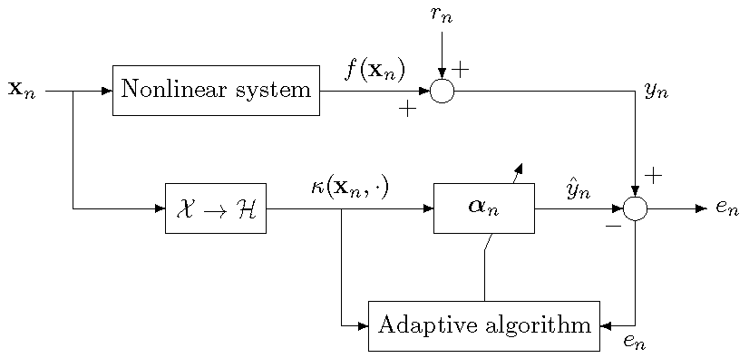

Kernel Adaptive Filtering Toolbox
===

A Matlab benchmarking toolbox for kernel adaptive filtering. 

Kernel adaptive filters are online machine learning algorithms based on kernel methods. Typical applications include time-series prediction, nonlinear adaptive filtering, tracking and online learning for nonlinear regression. This toolbox includes algorithms, demos, and tools to compare their performance.

<p align="center">

<div align="center"><i>Nonlinear system identification using kernel adaptive filtering.</i></div>
</p>  

Maintainer: [Steven Van Vaerenbergh](http://gtas.unican.es/people/steven), University of Cantabria, Spain.  
Contributors:  
- [Miguel Lazaro-Gredilla](http://www.tsc.uc3m.es/~miguel), Universidad Carlos III de Madrid, Spain.  
- [Sohan Seth](http://www.sohanseth.com/), University of Edinburgh, UK.  
- [Masahiro Yukawa](http://www.ykw.elec.keio.ac.jp/yukawa/), Keio University, Japan.  
- [Masa-aki Takizawa](http://www.ykw.elec.keio.ac.jp/member.html), Keio University, Japan.  
- [Osamu Toda](http://www.ykw.elec.keio.ac.jp/member.html), Keio University, Japan.  
- [Motoya Ohnishi] (http://www.ykw.elec.keio.ac.jp/member.html), Keio University, Japan.  
- [Dominik Rzepka](http://home.agh.edu.pl/~drzepka/), AGH University of Science and Technology, Poland.  
- [Pantelis Bouboulis](http://bouboulis.mysch.gr/), University of Athens, Greece.  
- [Stephan Rhode](https://www.fast.kit.edu/lff/1011_3295.php), Karlsruher Institut f&uuml;r Technologie, Germany.  

Official web: https://github.com/steven2358/kafbox/  

This toolbox is a collaborative effort: every developer wishing to contribute code or suggestions can do so. More info below.

Sample run
---
Figure generated by `demo/demo_sample_run.m`.
<p align="center">

<div align="center"><i>Online learning of a 1D nonlinear regression by a kernel adaptive filter on a fixed budget.</i></div>
</p>  

Directories included in the toolbox
---
`data/` - data sets

`demo/` - demos and test files

`doc/` - documentation

`lib/` - algorithm libraries and utilities

Setup
---

1. Run `install.m` to add the toolbox folders to the path.
2. Type `savepath` to save the changes to the path.


Octave / Matlab pre-2008a
-------------------------
This toolbox uses the `classdef` command which is not supported in Matlab pre-2008a and not yet in Octave. The older 0.x versions of this toolbox do not use `classdef` and can therefore be used with all versions of Matlab and Octave. http://sourceforge.net/projects/kafbox/files/

Usage
---
Each kernel adaptive filtering algorithm is implemented as a Matlab class. To use one, first define its options:
```matlab
options = struct('nu',1E-4,'kerneltype','gauss','kernelpar',32);
```
Next, create an instance of the filter. E.g., for an instance of the original KRLS algorithm run:
```matlab
kaf = krls(options);
```
One iteration of training is performed by feeding one input-output data pair to the filter:
```matlab
kaf.train(x,y);
```
The outputs for one or more test inputs are evaluated as follows:
```matlab
Y_test = kaf.evaluate(X_test);
```

Example: time-series prediction
---
Code from `demo/demo_prediction.m`
```matlab
% Demo: 1-step ahead prediction on Lorenz attractor time-series data
[X,Y] = kafbox_data(struct('file','lorenz.dat','embedding',6));

% make a kernel adaptive filter object of class krls with options: 
% ALD threshold 1E-4, Gaussian kernel, and kernel width 32
kaf = krls(struct('nu',1E-4,'kerneltype','gauss','kernelpar',32));

%% RUN ALGORITHM
N = size(X,1);
Y_est = zeros(N,1);
for i=1:N,
    if ~mod(i,floor(N/10)), fprintf('.'); end % progress indicator, 10 dots
    Y_est(i) = kaf.evaluate(X(i,:)); % predict the next output
    kaf.train(X(i,:),Y(i)); % train with one input-output pair
end
fprintf('\n');
SE = (Y-Y_est).^2; % test error

%% OUTPUT
fprintf('MSE after first 1000 samples: %.2fdB\n\n',10*log10(mean(SE(1001:end))));
```
Result:

    MSE after first 1000 samples: -40.17dB

Citing KAFBOX
---

If you use this toolbox in your research please cite ["A Comparative Study of Kernel Adaptive Filtering Algorithms"](http://gtas.unican.es/pub/356):

    @inproceedings{vanvaerenbergh2013comparative,
      author = {Van Vaerenbergh, Steven and Santamar{\'i}a, Ignacio},
      booktitle = {2013 IEEE Digital Signal Processing (DSP) Workshop and IEEE Signal Processing Education (SPE)},
      title = {A Comparative Study of Kernel Adaptive Filtering Algorithms},
      doi = {10.1109/DSP-SPE.2013.6642587},
      year = {2013},
      note = {Software available at \url{https://github.com/steven2358/kafbox/}}
    }
	
Included algorithms
---
- Kernel Recursive Least-Squares (KRLS) algorithm with approximate linear dependency criterion, as proposed in Y. Engel, S. Mannor, and R. Meir. "The kernel recursive least-squares algorithm", IEEE Transactions on Signal Processing, volume 52, no. 8, pages 2275-2285, 2004.
- Sliding-Window Kernel Recursive Least-Squares (SW-KRLS), as proposed in S. Van Vaerenbergh, J. Via, and I. Santamaria. "A sliding-window kernel RLS algorithm and its application to nonlinear channel identification", 2006 IEEE International Conference on Acoustics, Speech, and Signal Processing (ICASSP), Toulouse, France, 2006.
- Naive Online Regularized Risk Minimization Algorithm (NORMA), as proposed in J. Kivinen, A. Smola and C. Williamson. "Online Learning with Kernels", IEEE Transactions on Signal Processing, volume 52, no. 8, pages 2165-2176, 2004.
- Kernel Least-Mean-Square (KLMS), as proposed in W. Liu, P.P. Pokharel, and J.C. Principe, "The Kernel Least-Mean-Square Algorithm," IEEE Transactions on Signal Processing, vol.56, no.2, pp.543-554, Feb. 2008.
- Fixed-Budget Kernel Recursive Least-Squares (FB-KRLS), as proposed in S. Van Vaerenbergh, I. Santamaria, W. Liu and J. C. Principe, "Fixed-Budget Kernel Recursive Least-Squares", 2010 IEEE International Conference on Acoustics, Speech, and Signal Processing (ICASSP 2010), Dallas, Texas, U.S.A., March 2010.
- Kernel Recursive Least-Squares Tracker (KRLS-T), as proposed in S. Van Vaerenbergh, M. Lazaro-Gredilla, and I. Santamaria, "Kernel Recursive Least-Squares Tracker for Time-Varying Regression," IEEE Transactions on Neural Networks and Learning Systems, vol.23, no.8, pp.1313-1326, Aug. 2012.
- Quantized Kernel Least Mean Squares (QKLMS), as proposed in Chen B., Zhao S., Zhu P., Principe J.C., "Quantized Kernel Least Mean Square Algorithm," IEEE Transactions on Neural Networks and Learning Systems, vol.23, no.1, Jan. 2012, pages 22-32.
- Random Fourier Feature Kernel Least Mean Square (RFF-KLMS) algorithm, as proposed in Abhishek Singh, Narendra Ahuja and Pierre Moulin, "Online learning with kernels: Overcoming the growing sum problem," 2012 IEEE International Workshop on Machine Learning for Signal Processing (MLSP), Sept. 2012.
- Extended Kernel Recursive Least Squares (EX-KRLS), as proposed in W. Liu and I. Park and Y. Wang and J.C. Principe, "Extended kernel recursive least squares algorithm", IEEE Transactions on Signal Processing, volume 57, number 10, pp. 3801-3814, oct. 2009.
- Gaussian-Process based estimation of the parameters of KRLS-T, as proposed in Steven Van Vaerenbergh, Ignacio Santamaria, and Miguel Lazaro-Gredilla, "Estimation of the forgetting factor in kernel recursive least squares," 2012 IEEE International Workshop on Machine Learning for Signal Processing (MLSP), Sept. 2012.
- Kernel Affine Projection (KAP) algorithm with Coherence Criterion, as proposed in C. Richard, J.C.M. Bermudez, P. Honeine, "Online Prediction of Time Series Data With Kernels," IEEE Transactions on Signal Processing, vol.57, no.3, pp.1058,1067, March 2009.
- Kernel Normalized Least-Mean-Square (KNLMS) algorithm with Coherence Criterion, as proposed in C. Richard, J.C.M. Bermudez, P. Honeine, "Online Prediction of Time Series Data With Kernels," IEEE Transactions on Signal Processing, vol.57, no.3, pp.1058,1067, March 2009.
- Recursive Least-Squares algorithm with exponential weighting (RLS), as described in S. Haykin, "Adaptive Filtering Theory (3rd Ed.)", Prentice Hall, Chapter 13.
- Multikernel Normalized Least Mean Square algorithm with Coherence-based Sparsification (MKNLMS-CS), as proposed in M. Yukawa, "Multikernel Adaptive Filtering", IEEE Transactions on Signal Processing, vol.60, no.9, pp.4672-4682, Sept. 2012.
- Parallel HYperslab Projection along Affine SubSpace (PHYPASS) algorithm, as proposed in M. Takizawa and M. Yukawa, "An Efficient Data-Reusing Kernel Adaptive Filtering Algorithm Based on Parallel Hyperslab Projection Along Affine Subspace," 2013 IEEE International Conference on Acoustics, Speech, and Signal Processing (ICASSP), pp.3557-3561, May 2013.
- Fixed-budget kernel least mean squares (FB-KLMS) algorithm, as proposed in D. Rzepka, "Fixed-budget kernel least mean squares," 2012 IEEE 17th Conference on Emerging Technologies & Factory Automation (ETFA), Krakow, Poland, Sept. 2012.
- Leaky Kernel Affine Projection Algorithm (LKAPA, including KAPA-1 and KAPA-3) and Normalized Leaky Kernel Affine Projection Algorithm (NLKAPA, including KAPA-2 and KAPA-4), as proposed in W. Liu and J.C. Principe, "Kernel Affine Projection Algorithms", EURASIP Journal on Advances in Signal Processing, Volume 2008, Article ID 784292, 12 pages.
- Kernel Affine Projection Subgradient Method (KAPSM), as proposed in K. Slavakis, S. Theodoridis, and I. Yamada, "Online kernel-based classification using adaptive projection algorithms," IEEE Transactions on Signal Processing, Vol. 56, No. 7, pp. 2781-2796, 2008.
- Kernel Least Mean Squares algorithm with Coherence-Sparsification criterion and L1-norm regularization (KLMS-CSL1) and with active L1-norm regularization (KLMS-CSAL1), as proposed in Wei Gao, Jie Chen, Cédric Richard, Jianguo Huang, and Rémi Flamary, "Kernel LMS algorithm with forward-backward splitting for dictionary learning," 2013 IEEE International Conference on Acoustics, Speech, and Signal Processing (ICASSP 2013), Vancouver, Canada, March 2013.
- Mixture Kernel Least Mean Square (MXKLMS) algorithm, as proposed in R. Pokharel, S. Seth, and J.C. Principe, "Mixture kernel least mean square," The 2013 International Joint Conference on Neural Networks (IJCNN), pp.1-7, 4-9 Aug. 2013.
- Fixed budget quantized kernel least-mean-square algorithm (QKLMS-FB), as proposed in S. Zhao, B. Chen, P. Zhu, J. C. Príncipe, "Fixed budget quantized kernel least-mean-square algorithm", Signal Processing, Volume 93, Issue 9, September 2013, Pages 2759-2770.
- Probabilistic Least-Mean-Squares (ProbLMS) algorithm, as proposed in J. Fernandez-Bes, V. Elvira, and S. Van Vaerenbergh, "A probabilistic least-mean-squares filter," 2015 IEEE International Conference on Acoustics, Speech and Signal Processing (ICASSP), Brisbane, Australia, 2015.
- Discrete-time Kalman filter, as proposed in R. E. Kalman, "A New Approach to Linear Filtering and Prediction Problems", ASME Journal of Basic Engineering, 1960, 82(1), pp. 35-45.
- L2 algorithm with selective update, as proposed in M. Ohnishi and M. Yukawa, "Online Learning in L2 Space with Multiple Gaussian Kernels", Proceedings of the 25th European Signal Processing Conference (EUSIPCO), Kos, Greece, 2017.

How to contribute code to the toolbox
---
Option 1: email it to steven.vanvaerenbergh@unican.es

Option 2: [fork the toolbox on GitHub](https://github.com/steven2358/kafbox), push your changes, then send a pull request.

License
---
This source code is released under the FreeBSD License.
